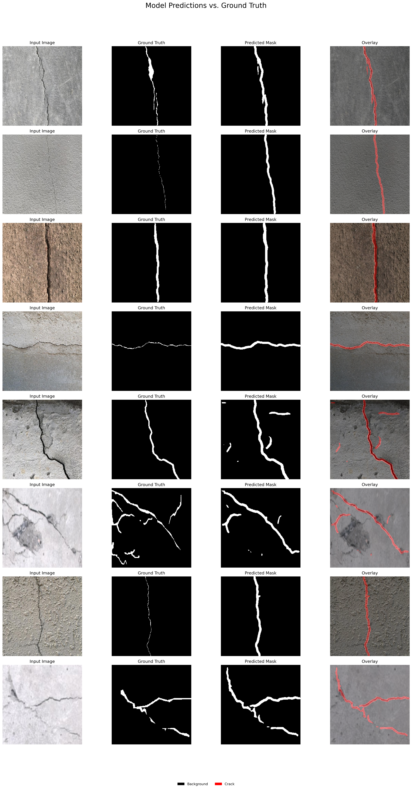

# 🧱 High-Performance Concrete Crack Segmentation with U-Net

This project presents a deep learning solution for **semantic segmentation** of cracks in concrete surfaces. The goal is to automate the critical yet time-consuming task of crack detection in civil infrastructure. By offering **pixel-level crack localization**, this model enhances the objectivity and efficiency of **Structural Health Monitoring (SHM)** programs.

> 🧠 Built on a U-Net architecture with attention mechanisms, the model achieved a **Dice Score of 0.93**, indicating high segmentation accuracy.

---

## 🎥 Visual Results Showcase

The following visuals highlight the model’s ability to accurately identify cracks across real-world examples.

### GIF

### Single Image

---

## 🚀 Key Features & Technical Highlights

- 🎯 **High Accuracy**  
  Achieved a **Dice Similarity Coefficient (DSC)** of **0.93** on the test set.

- 🧠 **Advanced Architecture**  
  Uses **U-Net** with integrated **attention modules** to focus on salient crack features.

- ⚖️ **Class Imbalance Handling**  
  Addresses the common challenge of few crack pixels vs. many background pixels using **class weighting** during training.

- 📏 **Pixel-Level Quantification**  
  Produces precise segmentation masks useful for computing **crack width**, **length**, and **density**.

---

## 📈 Performance

| Metric     | Score |
|------------|--------|
| Dice Score | 0.93   |

---

## 🧰 Tech Stack

| Component         | Tool/Library                         |
|------------------|--------------------------------------|
| Framework         | PyTorch                             |
| Data Augmentation | Albumentations                      |
| Image Processing  | OpenCV                              |
| Evaluation        | scikit-learn, Dice Score metric     |
| Dataset           | Public concrete crack image dataset |

---
## 🏗️ Applications in Structural Engineering

This project directly supports state-of-the-art SHM research and field applications:

- 📋 **Automated Condition Assessment**  
  Replace subjective visual inspections with objective, pixel-level crack maps.

- 🧠 **Digital Twin Enrichment**  
  Overlay segmentation data on 3D models from LiDAR/photogrammetry for smart infrastructure management.

- 🔧 **Maintenance Prioritization**  
  Quantify crack severity to inform predictive maintenance schedules.

- 🤖 **Robotic Repair Systems**  
  Supply accurate crack locations to future robotic agents for autonomous repair.

---

## 🔮 Future Work

- 📐 **Crack Quantification**  
  Automatically compute crack **length**, **width**, and **orientation** from segmentation masks.

- 📲 **Real-Time Deployment**  
  Optimize the model with **quantization** or **pruning** for use on **drones** or **edge devices**.

- 🧱 **Multi-Damage Segmentation**  
  Extend the model to detect **spalling**, **efflorescence**, **rebar exposure**, and other damage types.

---

## 📚 Sources & Related Content

- U-Net Paper: [Ronneberger et al. (2015)](https://arxiv.org/abs/1505.04597)  
- Attention Mechanisms: [Oktay et al. (2018) - Attention U-Net](https://arxiv.org/abs/1804.03999)  
- Crack Dataset: [(https://universe.roboflow.com/crack-detection-msd4g/crack-semantic-segmentation)]

---

> 👷 Designed to enable smarter inspection workflows and accelerate the future of intelligent infrastructure.
